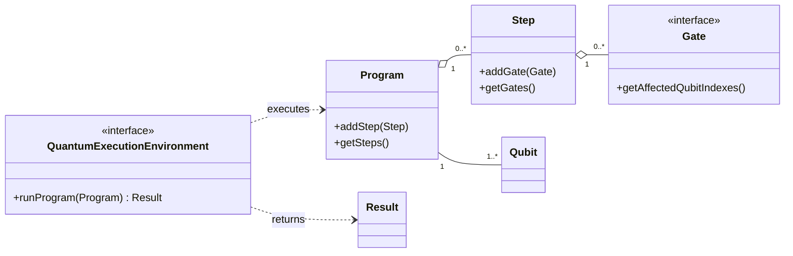

# JavaQC

## Introduction

JavaQC is a Java-based quantum computing API and simulator built on the Strange model. It keeps the circuit abstraction, adds a local state-vector simulator, adds text and JSON rendering, and exposes cloud adapters through a common interface.

The project is meant to be readable, didactic, and practical at the same time: you can run circuits locally with no secrets, inspect them as text or OpenQASM, and opt into cloud providers through the adapter layer when you need them.

[](https://github.com/redfx-quantum/strange/actions/workflows/build.yml)
[](https://redfx-quantum.github.io/strange/)
[](https://search.maven.org/#search|ga|1|org.redfx.strange)
[](https://opensource.org/licenses/GPL-3.0)
[](https://javadoc.io/doc/org.redfx/strange)

## Documentation

- [Project overview](docs/about.md)
- [Long-form project description](docs/project-description.md)
- [Code walkthrough](docs/code-walkthrough.md)
- [Architecture](docs/architecture.md)
- [Getting started](docs/getting-started.md)
- [Cloud providers](docs/cloud-providers.md)
- [Vaults and secrets](docs/vault-and-secrets.md)
- [API reference](docs/api-reference.md)
- [Pasqal integration](docs/pasqal-integration.md)

## What Is In The Repo

- `org.redfx.strange`: core quantum model and execution contracts
- `org.redfx.strange.local`: local simulator implementation
- `org.redfx.strange.print`: plain text, JSON, OpenQASM, and ASCII circuit output
- `com.gluonhq.strange.cloudlink.adapters`: cloud provider adapters
- `com.gluonhq.strange.cloudlink.vault`: secret loading and vault selection
- `org.redfx.strange.demo`: CLI entry points
- `site/`: small browser preview and backend helper

## Full Project Summary

The project is organized around a simple idea: define a quantum circuit once, execute it locally or send it to a cloud provider, then render the outcome in a human-readable form.

At a high level:

1. `Program` describes the circuit.
2. `Step` groups gates that run together.
3. `Gate` models the quantum operation itself.
4. `QuantumExecutionEnvironment` runs the program.
5. `SimpleQuantumExecutionEnvironment` runs it locally.
6. `QuantumCloudProvider` adapts it for cloud execution.
7. `TextPrinter` turns the result into plain text, JSON, ASCII circuit diagrams, or OpenQASM.

That makes the repository both a simulator and a translation layer. It is useful as a learning project because the code path is visible from the circuit model all the way to the output.

## Code Tour

### Core Quantum Model

The classes in `org.redfx.strange` are the heart of the project.

- `Program` owns the number of qubits, the ordered list of steps, and the final result.
- `Step` groups gates that should be applied together.
- `Gate` is the abstraction for quantum operations.
- `Qubit` stores measured state information.
- `Result` stores the execution result and probabilities.

This layer is the source of truth for the entire repo.

### Local Execution

The local simulator in `org.redfx.strange.local` is the zero-secret path.

- `SimpleQuantumExecutionEnvironment` walks through the program and applies each step.
- `Computations` performs the matrix and vector math behind the scenes.

This is the implementation you use when you want the project to run immediately after cloning, with no cloud setup.

### Rendering and Serialization

`org.redfx.strange.print.TextPrinter` is the presentation layer.

- `toPlain(...)` prints the program and probabilities.
- `toJson(...)` emits a compact JSON summary.
- `toOpenQasm(...)` exports a circuit to OpenQASM 2.0 where the supported gates map cleanly.
- `toCircuit(...)` prints an ASCII circuit diagram.

This layer is why the project works well in terminals, containers, and browser-backed previews.

### Cloud Integration Layer

`com.gluonhq.strange.cloudlink` is where the adapter pattern lives.

- `QuantumCloudProvider` defines the common cloud contract.
- `adapters/*` translate Strange circuits into provider-specific payloads.
- `vault/*` resolves secrets from Azure Key Vault, HashiCorp Vault, or environment variables.

The adapters are deliberately separate from the core model so the quantum circuit code does not depend on any one provider.

## Adapter Interpretation

The adapter layer is the bridge between the Strange model and the outside world.

The pattern is:

1. The CLI chooses a provider.
2. The adapter checks whether the provider is available.
3. The adapter translates the Strange `Program` into the provider format.
4. The provider executes the circuit or returns sampled counts.
5. The adapter turns that response back into a Strange `Result`.
6. `TextPrinter` renders the result.

### AzureQuantumAdapter

The Azure adapter in [src/main/java/com/gluonhq/strange/cloudlink/adapters/AzureQuantumAdapter.java](src/main/java/com/gluonhq/strange/cloudlink/adapters/AzureQuantumAdapter.java) is currently a scaffold for Azure Quantum integration.

What it does now:

- reads Azure Quantum configuration from environment variables
- checks whether the subscription, resource group, and workspace are present
- exposes the standard cloud adapter methods from `QuantumCloudProvider`
- provides a placeholder path for translating Strange programs into Q# or Azure-ready payloads

What is still missing:

- a real REST or SDK submission path
- concrete circuit translation into Azure Quantum formats
- response parsing and count conversion

That makes it a clear extension point rather than a finished backend.

### Other Adapters

- `IbmQuantumAdapter` is the pure Java IBM path and already converts Strange circuits to OpenQASM before submitting them over HTTP.
- `QiskitAdapter` is a Python bridge that writes OpenQASM to a temporary file and calls `ibm_submit.py`.
- `PasqualAdapter` adds a richer credentials path with vault support and batch submission logic.
- `DWaveAdapter` currently documents the annealing translation path but is still incomplete.

## How To Read The Code

If you want to understand the repo quickly, read it in this order:

1. `src/main/java/org/redfx/strange/Program.java`
2. `src/main/java/org/redfx/strange/Step.java`
3. `src/main/java/org/redfx/strange/QuantumExecutionEnvironment.java`
4. `src/main/java/org/redfx/strange/local/SimpleQuantumExecutionEnvironment.java`
5. `src/main/java/org/redfx/strange/print/TextPrinter.java`
6. `src/main/java/com/gluonhq/strange/cloudlink/providers/QuantumCloudProvider.java`
7. `src/main/java/com/gluonhq/strange/cloudlink/adapters/AzureQuantumAdapter.java`
8. `src/main/java/org/redfx/strange/demo/TextDemo.java`

That path gives you the full circuit life cycle from definition to output.

## Build Paths

- Maven: the primary build in [pom.xml](pom.xml)
- Ant: compatibility build in [build.xml](build.xml)
- Gradle: auxiliary tree in [gradlebuild/build.gradle.kts](gradlebuild/build.gradle.kts)

## Quick Start

### Run locally without secrets

Prerequisites:

- Java 17 or newer
- Maven 3.8+

From the project root, build and run the local simulator:

```bash
mvn test
mvn -DskipTests package
java -cp target/classes org.redfx.strange.demo.TextDemo --provider local --format plain
```

Render an ASCII circuit instead of plain output:

```bash
java -cp target/classes org.redfx.strange.demo.TextDemo --provider local --format circuit
```

Export structured JSON for browser rendering:

```bash
java -cp target/classes org.redfx.strange.demo.TextDemo --export-json site/program.json
```

For a simple browser preview, you can also serve the bundled site files:

```bash
cd site
python3 server.py
```

Cloud execution is optional. The local simulator works without secrets and should be the default path for new users.

## Cloud Providers

Cloud execution is opt-in. The local simulator works without secrets.

- IBM Quantum: `IbmQuantumAdapter`
- IBM via Qiskit: `QiskitAdapter`
- Pasqal: `PasqualAdapter`
- D-Wave: `DWaveAdapter`
- QMware, Xanadu, Google Cirq, Azure Quantum: additional adapter entry points

See [cloud providers](docs/cloud-providers.md) and [vaults and secrets](docs/vault-and-secrets.md).

## Execution Model



## Practical Rule

If you want a clone-and-run experience, the repository should always start in local simulator mode without asking for cloud credentials. Cloud secrets belong in a vault or other one-time bootstrap configuration, not in the normal run loop.
