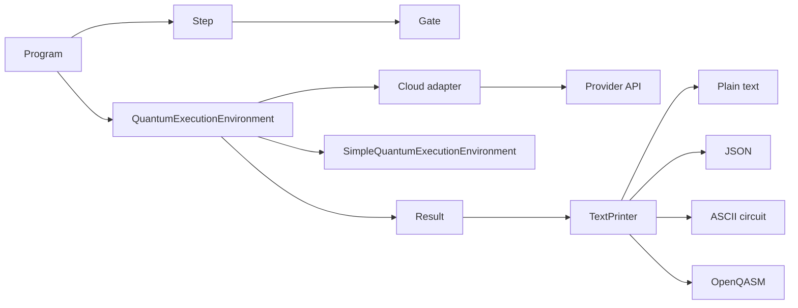
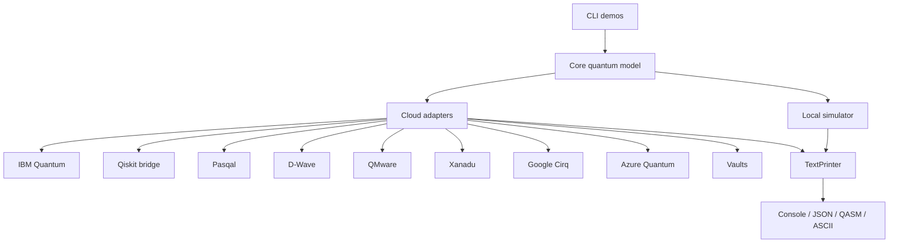

# Architecture

JavaQC is built as a layered system:

- **Core quantum model** in `org.redfx.strange`
- **Local execution engine** in `org.redfx.strange.local`
- **Text and circuit rendering** in `org.redfx.strange.print`
- **Cloud adapter layer** in `com.gluonhq.strange.cloudlink.adapters`
- **Secret management** in `com.gluonhq.strange.cloudlink.vault`
- **CLI entry points** in `org.redfx.strange.demo`
- **Static browser preview** in `site/`

## Execution Flow

## Core Packages

### org.redfx.strange

This is the public quantum domain model.

- `Program` holds qubit count, steps, and the execution result.
- `Step` groups gates that run together.
- `Gate` is the base operation abstraction.
- `Qubit` and `Result` represent measured outcomes and probability state.
- `QuantumExecutionEnvironment` defines the execution contract.

### org.redfx.strange.gate

Contains gate implementations such as `X`, `Y`, `Z`, `Hadamard`, `Cnot`, `Swap`, `Toffoli`, `Measurement`, and arithmetic / oracle / rotation gates.

### org.redfx.strange.local

Contains the local state-vector simulator.

- `SimpleQuantumExecutionEnvironment` executes programs step by step.
- `Computations` performs matrix and vector operations.

### org.redfx.strange.print

Contains the printer and serializer layer.

- `TextPrinter.toPlain(...)` prints the program and probabilities.
- `TextPrinter.toJson(...)` emits a compact JSON summary.
- `TextPrinter.toOpenQasm(...)` exports supported gates to OpenQASM 2.0.
- `TextPrinter.toCircuit(...)` renders an ASCII circuit diagram.

### com.gluonhq.strange.cloudlink

Contains the cloud integration layer.

- `providers/QuantumCloudProvider` defines the adapter contract.
- `adapters/*Adapter` classes translate Strange programs to provider-specific formats.
- `vault/*` classes resolve secrets from Azure Key Vault, HashiCorp Vault, or environment variables.

## Adapter Pattern

The cloud layer is built around the adapter pattern:

1. `TextDemo` or another entry point selects a provider.
2. The selected adapter implements `QuantumCloudProvider`.
3. The adapter converts a `Program` to the provider’s input format.
4. The provider returns counts or measurement results.
5. The adapter converts those results back to `Result`.
6. `TextPrinter` renders the output.

## Repository-Level View

## Important Constraint

The local simulator is the default no-secrets path. Cloud providers are opt-in and require configuration, usually through environment variables or a vault.
