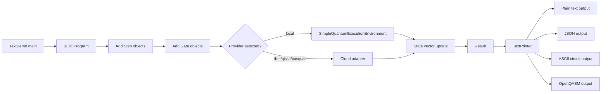

# Code Walkthrough

This file explains the code directly. Each section shows a real code path from the repository first, then explains what that code does and why it matters.

## 1. The Program Model

```java
public class Program {

    private final int numberQubits;
    private Result result;
    private double[] initAlpha;

    private final ArrayList<Step> steps = new ArrayList<>();

    // cache decomposedSteps
    private List<Step> decomposedSteps = null;
```

`Program` is the center of the repository. It stores the number of qubits, the execution result, the initial qubit amplitudes, and the ordered list of steps that make up the circuit.

The `steps` list is the actual circuit. Each `Step` groups gates that belong together. The `decomposedSteps` field is a cache used by the local execution engine so it does not need to recompute a decomposition every time the same program is run.

```java
public void addStep(Step step) {
    if (!ensureMeasuresafe(Objects.requireNonNull(step))) {
        throw new IllegalArgumentException("Adding a superposition step to a measured qubit");
    }
    step.setIndex(steps.size());
    step.setProgram(this);
    steps.add(step);
    this.decomposedSteps = null;
}
```

This method is the main mutation point for the circuit. Before the step is added, the program checks whether the new step would violate measurement safety. After the step is added, the decomposition cache is cleared because the circuit structure changed.

That cache invalidation is important. The execution engine can only reuse a decomposition when the circuit has not changed. If a new step is added and the cache is not cleared, the simulator could run stale data.

```java
private boolean ensureMeasuresafe(Step newStep) {
    List<Integer> mainQubits = new ArrayList<>();
    for (Gate g : newStep.getGates()) {
        if (g instanceof Hadamard) {
            mainQubits.add(g.getMainQubitIndex());
        } else if (g instanceof Cnot) {
            mainQubits.add(((Cnot) g).getSecondQubitIndex());
        }
    }
    for (Step step : this.getSteps()) {
        boolean match = step.getGates().stream().filter(g -> g instanceof Measurement)
                .map(Gate::getMainQubitIndex).anyMatch(mainQubits::contains);
        if (match)
            return false;
    }
    return true;
}
```

This is the guard that prevents a measured qubit from being pushed back into superposition later in the circuit. The method inspects the new step, collects the qubits that could be affected, and then compares those qubits with earlier measurement operations.

The rule is simple: once a qubit has been measured, later steps should not casually reintroduce superposition on that same qubit. This keeps the program model consistent and avoids surprising behavior in later execution.

## 2. The CLI Entry Point

```java
public static void main(String[] args) throws Exception {
    String format = "plain";
    String provider = "local";
    String backend = "ibmq_qasm_simulator";
    int shots = 1024;
    String example = "bell";
    String exportJson = null;
```

`TextDemo` is the runnable entry point. It starts with sensible defaults so the program can run immediately without passing any arguments.

The defaults matter because the repository is intended to be usable as a local simulator first. A user should be able to clone the project and run it without first setting up cloud credentials.

```java
for (int i = 0; i < args.length; i++) {
    if ("--format".equals(args[i]) && i + 1 < args.length)
        format = args[++i];
    if ("--provider".equals(args[i]) && i + 1 < args.length)
        provider = args[++i];
    if ("--backend".equals(args[i]) && i + 1 < args.length)
        backend = args[++i];
    if ("--shots".equals(args[i]) && i + 1 < args.length)
        shots = Integer.parseInt(args[++i]);
    if ("--example".equals(args[i]) && i + 1 < args.length)
        example = args[++i];
    if ("--export-json".equals(args[i]) && i + 1 < args.length)
        exportJson = args[++i];
}
```

This loop parses the CLI flags manually. That keeps the demo simple and dependency-free. It is easy to run from a command line because there is no argument parsing framework to install or configure.

Each flag controls one part of the demo: the output format, the provider, the backend name, the number of shots, the example circuit, and the optional JSON export path.

```java
switch (example.toLowerCase()) {
    case "ghz":
        p = new Program(3);
        Step g1 = new Step();
        g1.addGate(new Hadamard(0));
        p.addStep(g1);
        Step g2 = new Step();
        g2.addGate(new Cnot(0, 1));
        p.addStep(g2);
        Step g3 = new Step();
        g3.addGate(new Cnot(0, 2));
        p.addStep(g3);
        Step gm = new Step();
        gm.addGates(new Measurement(0), new Measurement(1), new Measurement(2));
        p.addStep(gm);
        break;
```

This is one of the example circuits. The demo builds a GHZ state by applying a Hadamard gate and then two controlled-NOT gates. The last step measures all qubits.

This code shows a pattern that repeats throughout the repository: define a program, build steps, add gates, and then let the chosen execution environment run the circuit.

```java
if (exportJson != null) {
    try {
        org.json.JSONObject obj = TextPrinter.toStructuredJson(p);
        java.nio.file.Path path = java.nio.file.Paths.get(exportJson);
        java.nio.file.Files
                .createDirectories(path.getParent() == null ? java.nio.file.Paths.get(".") : path.getParent());
        java.nio.file.Files.writeString(path, obj.toString(2));
        System.out.println("Wrote " + exportJson);
        return;
    } catch (Exception ex) {
        System.err.println("Failed to write export json: " + ex.getMessage());
        System.exit(1);
    }
}
```

This block turns the program into structured JSON and writes it to disk. It exits early because JSON export is a data-producing mode, not a simulation mode.

That early return keeps the command behavior predictable. If the user asked for export only, the demo does not also run the circuit and print a second result.

## 3. Provider Selection

```java
if ("ibm".equalsIgnoreCase(provider)) {
    QuantumCloudProvider cloudProvider = new IbmQuantumAdapter(null, backend);
    if (!cloudProvider.isAvailable()) {
        System.err.println("Error: IBM token not available. Set IBM_QUANTUM_TOKEN env var.");
        System.exit(1);
    }
    Result res = cloudProvider.submitProgram(p, shots);
    if ("json".equalsIgnoreCase(format)) {
        System.out.println(TextPrinter.toJson(p, res));
    } else if ("circuit".equalsIgnoreCase(format)) {
        System.out.println(TextPrinter.toProbabilities(res));
    } else {
        System.out.println(TextPrinter.toPlain(p, res));
    }
    return;
}
```

This branch shows how cloud execution is isolated from the rest of the code. The demo chooses an adapter, checks availability, submits the program, and then renders the result.

The important part is that the `Program` object itself does not change. The provider-specific logic lives outside the core model, so the circuit representation stays stable.

The IBM, Qiskit, and Pasqal branches all follow the same idea. They differ in how the adapter is created and how availability is checked, but the flow remains the same.

```java
SimpleQuantumExecutionEnvironment sqee = new SimpleQuantumExecutionEnvironment();
Result res = sqee.runProgram(p);
```

This is the default local path. It is the simplest way to run the project because it does not require any external service.

The local simulator is the baseline implementation. It is the path that makes the repository useful immediately after checkout, and it is the path that most clearly demonstrates the circuit model.

## 4. Text Rendering

```java
public static String toPlain(Program p, Result r) {
    StringBuilder sb = new StringBuilder();
    sb.append("Program with ").append(p.getNumberQubits()).append(" qubits\n");
    sb.append("Steps:\n");
    for (Step s : p.getSteps()) {
        sb.append(" - ");
        sb.append(s.getGates().toString()).append("\n");
    }
```

`toPlain` is the simplest renderer. It prints the size of the program and lists the gates in each step.

This is useful for CLI output and logs because it gives a quick textual summary of what the circuit contains.

```java
public static String toJson(Program p, Result r) {
    StringBuilder sb = new StringBuilder();
    sb.append("{");
    sb.append("\"nqubits\":").append(p.getNumberQubits()).append(",");
    sb.append("\"steps\":");
```

`toJson` provides a compact machine-readable version of the program. It is useful when another tool or a browser preview needs to consume the circuit data.

The JSON output is intentionally simple. The repository is not trying to create a large schema; it is trying to expose the circuit in a form that is easy to inspect and reuse.

```java
public static JSONObject toStructuredJson(Program p) {
    JSONObject root = new JSONObject();
    root.put("nqubits", p.getNumberQubits());
    JSONArray stepsArr = new JSONArray();
```

`toStructuredJson` is the richer browser-oriented format. It records gate types, captions, and targeted qubits so a frontend can render the circuit with more structure.

This method is the bridge between the internal circuit model and a visual UI. It keeps the rendering logic outside the quantum execution logic.

```java
public static String toCircuit(Program p) {
    int nq = p.getNumberQubits();
    List<Step> steps = p.getSteps();
    int cellWidth = 7;
```

`toCircuit` turns the program into an ASCII circuit diagram. It is a presentation layer, not an execution layer.

The method arranges each step into a fixed-width column so the result is readable in a terminal. That makes it useful when the user wants to understand the layout of the circuit without opening a graphical tool.

## 5. Local Execution

```java
public Result runProgram(Program p) {
    int nQubits = p.getNumberQubits();
    Qubit[] qubit = new Qubit[nQubits];
    for (int i = 0; i < nQubits; i++) {
        qubit[i] = new Qubit();
    }
```

The local execution engine starts by allocating qubit objects and building the initial state vector.

This is where the simulator becomes concrete. The circuit model is abstract, but the execution engine has to produce a numerical state that can be updated gate by gate.

```java
List<Step> steps = p.getSteps();
List<Step> simpleSteps = p.getDecomposedSteps();
if (simpleSteps == null) {
    simpleSteps = new ArrayList<>();
    for (Step step : steps) {
        simpleSteps.addAll(Computations.decomposeStep(step, nQubits));
    }
    p.setDecomposedSteps(simpleSteps);
}
```

This block shows the same cache that `Program` invalidates when its structure changes. The execution engine asks for the decomposed steps, computes them if necessary, and then stores them back on the program.

That is why the earlier cache invalidation matters. The program and the execution engine cooperate through that shared cache to avoid repeated work.

```java
for (Step step : simpleSteps) {
    if (!step.getGates().isEmpty()) {
        probs = applyStep(step, probs, qubit);
        int idx = step.getComplexStep();
        if (idx > -1) {
            result.setIntermediateProbability(idx, probs);
        }
    }
}
```

This is the actual execution loop. Each step updates the current state vector, and intermediate probabilities are recorded when the step corresponds to a more complex original step.

The result is that the simulator keeps track of both the final outcome and useful intermediate state, which makes debugging and teaching much easier.

```java
double[] qp = calculateQubitStatesFromVector(probs);
for (int i = 0; i < nQubits; i++) {
    qubit[i].setProbability(qp[i]);
}
result.measureSystem();
p.setResult(result);
```

The final part of the execution converts the final vector into per-qubit probabilities, measures the system, and stores the result back on the program.

That last line is important because it closes the loop. The `Program` that was passed into the simulator comes back with a populated `Result` object attached.

## 6. How The Pieces Fit Together



This diagram shows the entire runtime path.

A user starts in the CLI demo, builds a program, runs it either locally or through a cloud adapter, receives a result, and then sends that result through a printer. That is the repository in one view.

## 7. Cloud Adapter Layer

The cloud adapter layer is where the repository turns one internal circuit model into many provider-specific execution paths. The important design rule is that the core program model stays the same while the translation logic changes per vendor.

### IBM Quantum

```java
public class IbmQuantumAdapter implements QuantumCloudProvider {
```

This adapter is the pure Java IBM path. It translates a Strange program into OpenQASM, sends the circuit over `HttpClient`, and converts the returned counts into a `Result`.

The key ideas in this adapter are:

- it uses `TextPrinter.toOpenQasm(...)` as the translation step
- it submits a JSON payload with `qasm`, `shots`, and `backend`
- it reads `counts` from the HTTP response
- it turns those counts into probabilities in `submitProgram(...)`

This is the most direct provider example in the repository because the whole flow stays inside Java.

### IBM Quantum Via Qiskit

```java
public class QiskitAdapter implements QuantumCloudProvider {
```

This adapter is the Python bridge path. It still uses OpenQASM as the circuit export format, but instead of sending the request directly to IBM from Java, it writes QASM to a temporary file and calls `ibm_submit.py`.

The important responsibilities are:

- translate the Strange program into OpenQASM
- create a temporary `.qasm` file
- invoke the Python bridge script with `ProcessBuilder`
- parse the JSON response returned by the script
- clean up the temporary file afterward

This adapter demonstrates how the repository can support a foreign runtime without changing the core program model.

### Pasqal

```java
public class PasqualAdapter implements QuantumCloudProvider {
```

This adapter models the Pasqal neutral-atom workflow. It is more involved than the IBM path because it also includes credential loading and token handling.

The main pieces are:

- environment variables for local development
- optional vault-backed secret lookup
- a cached OAuth access token
- batch submission to the Pasqal API
- polling for completion and result retrieval

The adapter is a good example of how secrets are kept outside the core model. The circuit stays the same; only the execution transport changes.

### Azure Quantum

```java
public class AzureQuantumAdapter implements QuantumCloudProvider {
```

This adapter is intentionally scaffolded. It checks whether the Azure Quantum environment values are present, exposes the provider contract, and leaves the real submission path as a TODO.

What it already shows is structurally important:

- configuration is read from the environment
- availability is checked before execution
- a placeholder conversion step exists for future Q# or Azure payload generation
- the method boundaries already match the common provider contract

That makes the file a useful architectural example even before the backend is complete.

### D-Wave

`DWaveAdapter` is the annealing-oriented entry point. The repository treats it as a provider-specific translation point for QUBO or Ising-style workflows, but it is still partial compared with the IBM and Pasqal paths.

The main value of this adapter is that it documents where an annealing model would fit in the adapter tree.

### QMware

`QMwareAdapter` represents another provider-specific bridge. It follows the same broad pattern as the other adapters: accept a Strange program, translate it into the provider shape, and return the result through the common contract.

Even when the implementation is thinner than the IBM path, the architectural role stays the same.

### Xanadu

`XanaduAdapter` is the photonic provider path. It sits in the same adapter family and exists so the repository can map its internal program model to a provider with a different backend style.

### Google Cirq

`GoogleCirqAdapter` is the Cirq-oriented path. It shows how a Strange program can be mapped into another quantum framework instead of a direct hardware API.

### Adapter Summary

Across all providers, the adapter pattern is the same:

1. `TextDemo` selects the provider.
2. The adapter checks availability.
3. The adapter translates the Strange `Program`.
4. The provider receives the translated payload.
5. The response is mapped back to `Result` or counts.
6. `TextPrinter` turns the result into readable output.

That is the cloud layer in one sentence: translation in, translation out, core model unchanged.

## 8. Drawing Architecture

The drawing code lives in `TextPrinter.toCircuit(...)`. It is a small rendering engine that turns the program into an ASCII circuit diagram by building the visual output one step at a time.

```java
public static String toCircuit(Program p) {
    int nq = p.getNumberQubits();
    List<Step> steps = p.getSteps();
    int cellWidth = 7;

    String[] topRows = new String[nq];
    String[] midRows = new String[nq];
    String[] botRows = new String[nq];
    String[] linkRows = new String[Math.max(0, nq - 1)];
```

This is the main layout setup.

The renderer splits the output into three visual rows per qubit, plus connection rows between qubits. That gives it enough flexibility to render both single-qubit gates and multi-qubit gates in one consistent text layout.

The `cellWidth` value makes each step column line up. Without fixed-width cells, the diagram would drift and become unreadable.

```java
for (Step s : steps) {
    String[] topCell = new String[nq];
    String[] midCell = new String[nq];
    String[] botCell = new String[nq];
    String[] linkCell = new String[Math.max(0, nq - 1)];
```

Each step gets its own temporary drawing buffers.

This is important because the renderer needs to calculate the text for one step before appending it to the long circuit string. The step-level buffers keep the diagram logic local and make the final concatenation easier.

```java
for (Gate g : s.getGates()) {
    java.util.List<Integer> affected = g.getAffectedQubitIndexes();
    if (affected == null || affected.isEmpty())
        continue;
```

The renderer asks each gate which qubits it affects. That means the gate itself tells the printer how wide or connected it needs to be.

This is a clean separation. The printer does not need to know the semantics of every gate class in advance; it only needs the affected qubit indexes and a caption.

```java
if (affected.size() == 1) {
    int q = affected.get(0);
    String cap = shortCap(g.getCaption());
    topCell[q] = " ┌───┐ ";
    midCell[q] = "─┤ " + padCap(cap) + " ├─";
    botCell[q] = " └───┘ ";
}
```

This is the single-qubit drawing path.

The renderer draws a small box around the gate caption. `shortCap(...)` reduces the caption to a compact label, and `padCap(...)` keeps the center cell aligned.

```java
else if (affected.size() == 2) {
    int a = affected.get(0);
    int b = affected.get(1);
    int min = Math.min(a, b);
    int max = Math.max(a, b);
    midCell[min] = "───●───";
    midCell[max] = "───X───";
    for (int j = min + 1; j < max; j++) {
        midCell[j] = "───│───";
    }
    for (int j = min; j < max; j++) {
        linkCell[j] = "   │   ";
    }
}
```

This is the connected two-qubit path.

The renderer places a control dot on one qubit and a target mark on the other, then draws a vertical line between them. That is what makes CNOT-style gates readable in the terminal.

```java
else if (g instanceof Toffoli && affected.size() == 3) {
    int c1 = affected.get(0);
    int c2 = affected.get(1);
    int tgt = affected.get(2);
    int min = Math.min(c1, Math.min(c2, tgt));
    int max = Math.max(c1, Math.max(c2, tgt));
```

This is the special multi-control path.

Toffoli needs an explicit branch because it has two control qubits and one target qubit. The renderer fills the span between them with a vertical connection and marks each role in its own position.

```java
int totalWidth = cellWidth * Math.max(1, steps.size());
String eq = repeat('═', totalWidth);
sb.append("c_0: ").append(eq).append('\n');
```

The final bottom line draws the classical wire across the width of the circuit.

That line closes the diagram visually and reminds the reader that measurement eventually feeds back into classical output.

### Helper Methods In The Drawing Layer

```java
private static String shortCap(String caption) {
    if (caption == null || caption.isEmpty())
        return "?";
    caption = caption.trim();
    if (caption.equalsIgnoreCase("Hadamard"))
        return "H";
    if (caption.equalsIgnoreCase("Measurement"))
        return "M";
    if (caption.length() == 1)
        return caption.toUpperCase();
    return caption.substring(0, 1).toUpperCase();
}
```

This helper makes captions short enough to fit in the gate box.

It is a small but important piece of the drawing architecture because the printer has to balance readability with width. Longer labels would make the diagram harder to scan.

```java
private static String padCap(String s) {
    if (s == null)
        s = "?";
    if (s.length() >= 1)
        return s.substring(0, 1);
    return " ";
}
```

This helper keeps the caption centered and stable inside the ASCII gate box.

```java
private static String repeat(char c, int n) {
    StringBuilder sb = new StringBuilder();
    for (int i = 0; i < n; i++)
        sb.append(c);
    return sb.toString();
}
```

This helper is used to draw the long horizontal wires. It is simple, but it is part of what makes the final output uniform.

### Drawing Architecture Summary

The drawing pipeline is:

1. Start with the program and its qubit count.
2. Allocate one drawing buffer per row.
3. Render one step into temporary step buffers.
4. Copy the step buffers into the final row strings.
5. Draw the classical output line at the bottom.
6. Return one final ASCII string.

This makes the circuit renderer a small layout engine rather than a dump of gate names.

## 9. What To Read Next

If you want the deepest understanding of the code, read the files in this order:

1. `src/main/java/org/redfx/strange/Program.java`
2. `src/main/java/org/redfx/strange/Step.java`
3. `src/main/java/org/redfx/strange/gate/*`
4. `src/main/java/org/redfx/strange/local/SimpleQuantumExecutionEnvironment.java`
5. `src/main/java/org/redfx/strange/print/TextPrinter.java`
6. `src/main/java/org/redfx/strange/demo/TextDemo.java`

That order follows the real runtime path. It starts with the model, moves to execution, and ends with presentation.
